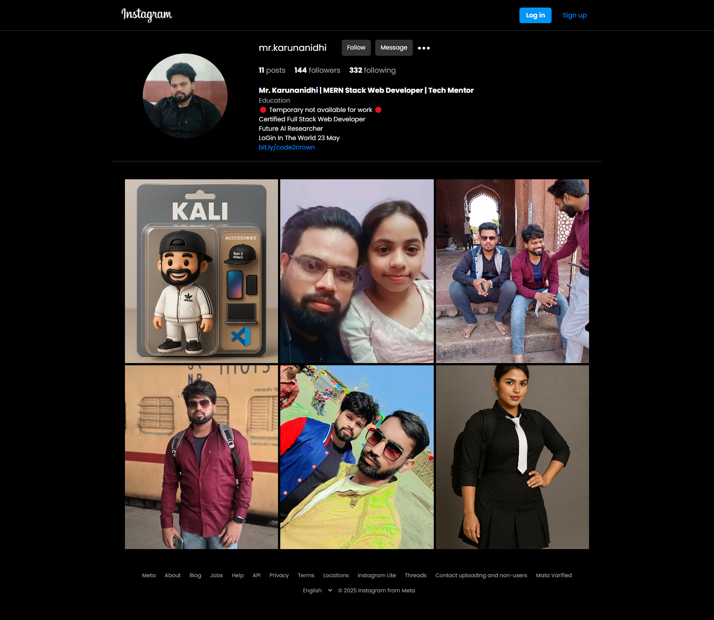
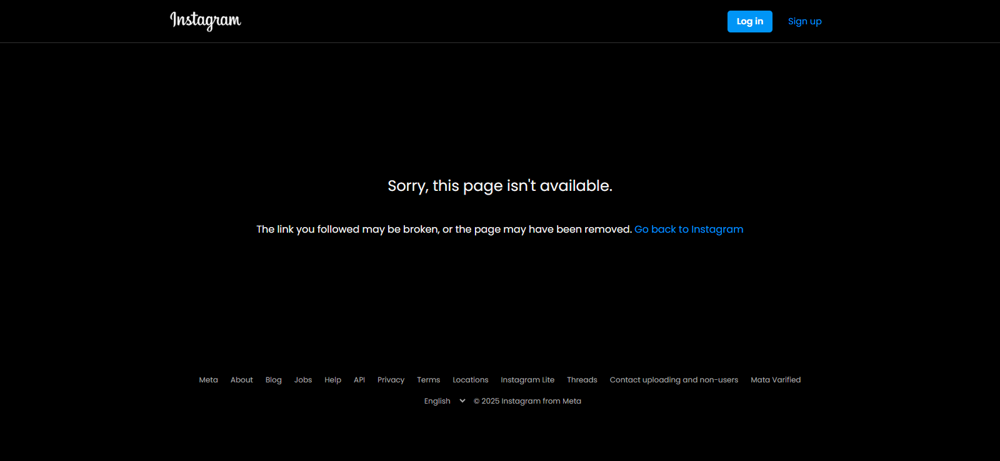

# 📸 Instagram Profile Page Clone

## 📋 Project Overview
**Instagram Profile Page Clone** ek web application hai jo Instagram ke ek user profile page ka clone banata hai.

Is project mein aap kisi username ko URL mein daal kar uska profile dekh sakte ho. Agar username ka data `data.JSON` file mein available hai to:
- Profile Photo
- Posts
- Followers, Following Counts
- Bio
- Follow aur Message buttons  
sab kuch Instagram ke tarah dikhayi dega.

---

## 🛠 Technologies Ka Upyog
- **NodeJS** (Server)
- **ExpressJS** (Routing aur Middleware ke liye)
- **EJS** (Dynamic HTML Templates)

---

## 🚀 Installation Steps

Apne system par project ko chalane ke liye neeche diye gaye steps follow karein:

1. **Project ko download karein ya clone karein:**
   ```bash
   git clone <repository-url>
   cd <project-folder-name>
   ```

2. **Project ke dependencies install karein:**
   ```bash
   npm install
   ```

3. **Server ko start karein:**
   ```bash
   npm start
   ```
   Agar `start` script nahi diya gaya hai, to manually:
   ```bash
   node app.js
   ```

4. **Browser mein open karein:**
   ```
   http://localhost:3000/username
   ```
   (yahan `username` woh hona chahiye jo `data.JSON` mein available hai.)

---

## 📖 Usage Instructions

- Browser mein `localhost:3000/username` likhein.
- Agar username `data.JSON` mein maujood hai, to uska pura profile page dikhega.
- Profile page mein aapko dikhai dega:
  - Profile Picture
  - Bio
  - Posts Count
  - Followers aur Following Count
  - Posts ka Grid view
  - Follow aur Message ke buttons
- Agar username ka data nahi milega to ek "Not Found" page show hoga.

---

## 🖼️ Screenshots

### 🔥 Profile Page Example


### ❌ Not Found Page


---

## 📂 Project Folder Structure

```
/project-root
│
├── node_modules/            # Installed npm packages
│
├── public/                  # Static files jaise CSS aur Images
│   ├── css/
│   │   ├── footer.css
│   │   ├── header.css
│   │   ├── home.css
│   │   ├── main.css
│   │   ├── notfound.css
│   │   └── profile.css
│   │
│   └── images/
│       └── (Logo, Profile Pictures, Posts Images)
│
├── views/                   # EJS Templates
│   ├── partials/             # Reusable header aur footer
│   │   ├── footer.ejs
│   │   └── header.ejs
│   │
│   ├── home.ejs              # Home page template
│   ├── notfound.ejs          # 404 error page
│   └── profile.ejs           # Profile page template
│
├── app.js                    # Main server file
├── data.JSON                 # User profiles ka data
├── package.json              # Project ka basic info aur dependencies
├── package-lock.json         # Packages ka exact version control
├── LICENSE                   # MIT License file
```

---

## ✨ Features

- Instagram jaise profile page ka layout
- Dynamic profile aur posts rendering
- Follow aur Message buttons ka design
- Local JSON file se data uthakar dikhana
- Responsive Design (agar CSS properly banayi hai to)

---

## 🛠 Future Improvements

- Database (MongoDB) ke saath connection
- Follow button ka actual functionality lagana
- Design ko aur responsive banana
- Advanced error pages banana

---

## 📜 License

Yeh project [MIT License](./LICENSE) ke under licensed hai.  
Aap is code ko free mein use, modify, aur distribute kar sakte hain, bas author ko proper credit dena zaroori hai.

---

# 🚀 Shukriya!

Agar aapko ye project pasand aaye ya madad kare to ⭐ star zaroor karein!  
Happy Coding! 🙌
